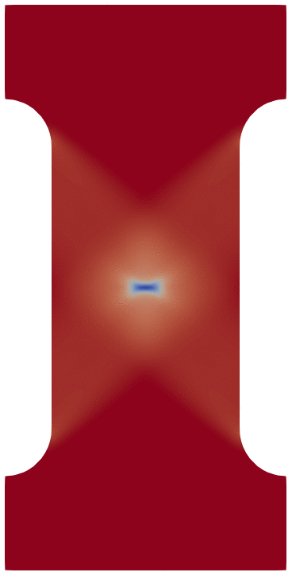

# Phase field fracture/ crack program (PFF) 


## About

<figure display="flex">

<figcaption>Crack propagation in I-Bar under monotonic loading</figcaption>
</figure>


This is the source code of phase field fracture (or crack) simulation program written in C++ and makes use of [deal.II](https://dealii.org/) finite element library version 9.5.1 ([1](https://doi.org/10.1515/jnma-2023-0089) [2](https://github.com/dealii/dealii/tree/dealii-9.5)). This program is written based on the phase field crack models presented in the following papers:
- [A review on phase-field models of brittle fracture and a new fast hybrid formulation](https://doi.org/10.1007/s00466-014-1109-y)
- [Phase-Field Modeling of Ductile Fracture](https://doi.org/10.1007/s00466-015-1151-4)

It allows parallel and serial simulation options between linear elastic fracture model, elastoplastic brittle fracture model and elastoplastic ductile fracture model with custom material parameters. The plasticty model used is linear isotropic hardening model. This program was part of the project "Coupling Dislocation Dynamics with Discrete Crack Mechanics to Study Fatigue Crack Growth in High Entropy Alloys" having project No. RP04378G. It was funded by [Science and Engineering Research Board](https://serb.gov.in/) and carried out at [Indian Institute Of Technology Delhi](https://home.iitd.ac.in/).

## Folder structure and file details

Folder structure will look something like this:
```
- PFF/
  - debug/
  - inputFiles/
    - options.h
    - params.in
    - *.msh files(e.g. Slit.msh, CTtest.msh, etc.)
  - PlotScripts/
  - results/
    - solution.pvd, tensor.pvd
    - solution *.*.vtu, solution *.pvtu, tensor *.*.vtu, tensor *.pvtu
    - stress_strain.txt
  - CMakeLists.txt
  - pfc.cc
  - update.sh
  - utils.cc
```

### Folders and files description

- `debug/`: Debugging related files enabled from inside the main program `pfc.cc`.
- `inputFiles/`: Contains parameters, mesh and option files for the program.
- `PlotScripts/`: User defined python scripts for post-processing and data visualization.
- `results/`: Results generated by the simulation. Complete time evolution simulation given in `*.pvd`. Individual time-step simulation given in `*.pvtu`. Each processors solution for a particular timestep is present in `*.vtu`. The files `solution*` contains FEM node data and avg. of a few other internal data at the nodes. The files`tensor*` contain projections of the quadrature point data at the nodes. Evolution of average stress, strain and few other variables at the loaded boundary with time is printed in `stress_strain.txt` file.
- `CMakeLists.txt`: Instructions for properly compiling and linking files for the program.
- `pfc.cc`: Core of the program, contains the class PFC and boundary condition for simulating the phase field crack.
- `update.sh`: Bash script for recompiling the code from scratch to improve workflow.
- `utils.cc`: Primitive functions for generating custom mesh using the deal.II’s internal functions.

## Program usage

For Quickstart jump to [Running](#running-the-program)

Main files which you will need to modify to customize simulation as per your requirements are `params.in`, `pfc.cc`, `*.msh`.

### Mesh

You can use already available meshes in the `pfc.cc` file or `inputFiles/` directory, or use [Gmsh](https://gmsh.info/) to create custom 2D or 3D model and export it. If you are not using any of the inbuilt meshes in the `pfc.cc` and intend to use custom mesh, you need to enable it by modifying the following options `params.in`:
```
mesh_type=custom_mesh

mesh_filename=inputFiles/Your_Mesh.msh
```

Ofcourse while designing the mesh you need to keep in mind that the refinement in the expected crack region needs to be of the similar or lower than the size of the length scale. Also during mesh construction assign the fixed Dirichlet boundary a boundary ID of 11, and the loading boundary must be assigned a boundary ID of 13.

### Input parameters

Most of the input parameters in `params.in` are self explanatory, important ones highlighted below:
- `load_type`: Keep it at 0 for monotonic loading. Fatigue loading is not well defined in the program, so to make use of it some minor changes will be required to `pfc.cc`.
- `strain_rate`: Strain rate needs `size_z` to compute the incremental displacement at the boundary and for the calculation of stress strain curve. Keep it at 1 for 2D mesh.
- `L_dam`: It is the crack length scale also called transition zone parameter. Crack region mesh refinement should be atleast of this size.
- `enable_bounding_box`: Keep it at 1 if you want it to automatically calculate the maximum of `size_x`, `size_y` and `size_z` for the mesh and use it for stress strain computation. If your mesh is unique such that Dirichlet boundary position and area does not match the bounding box, then keep it at 0. And manually enter `size_x`, `size_y` and `size_z` in `params.in`
- `enable_brittle_LEFM`, `enable_elastoplastic_brittle_fracture`: The program allows simulation of three different fracture models based on the paper. They are linear elastic fracture model (LEFM), elastoplastic brittle fracture model and elastoplastic ductile fracture model. Initially the program was written for just the ductile fracture, so assigning 0 to both does simulation for the same. Assigning 1 to LEFM parameter does simulation for linear elastic brittle fracture, while assigning 1 to the second parameter overrides the LEFM option and carries out elastoplastic brittle fracture model simulation.

There is one other point to keep in mind, for switching between 2D and 3D model you need to modify `PFC` class template in the `main`  function of `pfc.cc`.
```cpp
PFC<2, 3> fracture_problem;       // Either   // For plain strain 2D mesh
PFC<3, 3> fracture_problem;       // Or       // For 3D mesh
```
### Boundary conditions

Simulation by default uses Dirichlet boundary which relies on the identification of boundary ID assigned during the mesh creation process. To assign custom Dirichlet boundaries apply the appropriate boundary ID during the mesh creation process. Then modifiy and add the boundary functions `interpolate_boundary_values` in `pfc.cc` with the required argument values for the `IncrementalBoundaryValues` input function. Further the variable `present_strain` calculation will also need to be modified. To incorporate Neumann boundary, the program would require minor modifications to identify the said boundaries and apply normal stresses to such surfaces before and during `assemble_system_disp` function call.


### Visualizing the simulation results

Simulation results can be viewed using [Paraview](https://www.paraview.org/) program.

To create a line plot of average stress vs strain you can use already available python script. In the root folder of PFF enter the command:
```
python3 PlotScripts/strss_strain_plot.py results/stress_strain.txt
```

## Installation of Libraries

Several libraries are required to run this code. These include P4est, PetSc, Parmetis, and Deal.ii. Deal.ii makes it possible to install all these with the already made available [candi](https://github.com/dealii/candi) script, which we can use to install the libraries and automatically link to each other. As of February 2025, this code is compatible with deal.II version 9.5.1 **(Compatibility with the latest version has not been checked, the code might require forward porting with minor changes or possibly no changes at all.)**. All other libraries versions are automatically selected by candi during installation. We here describe the installation procedure with the Ubuntu OS.

First check the repositories are accessible with the `apt` and they are not giving any error. Try:
```
sudo apt update
```
If no error shows up then you are good to proceed. Next make sure the requirements following are met:
1. Use gcc version > 5. Check the version using
    ```
    gcc -v
    ```
2. Have MPICH installed with the gcc > 5. Check using
    ```
    which mpicc
    ```
    or
    ```
    mpirun --version
    ```
    Follow the step below if not installed.

### Install MPICH

1. Before installing MPICH also ensure that the other dependency for deal.II is fulfilled. For the Ubuntu OS you can check [here](https://github.com/dealii/candi/blob/master/deal.II-toolchain/platforms/supported/ubuntu.platform). Later, the same prompt will show up at the start of deal.II installation procedure which you can safely proceed without interrupting the installation. For other OS the requirement is mentioned in the [same](https://github.com/dealii/candi/blob/master/deal.II-toolchain/platforms/supported/) folder.
2. Download the latest version of MPICH from its [website](https://www.mpich.org/downloads/).
3. Install by following the [Guide](https://www.mpich.org/documentation/guides/). At the time of this code development Version [4.1.2](https://www.mpich.org/static/downloads/4.1.2/mpich-4.1.2-installguide.pdf) was available. Installation commands for `bash` terminal are summarized below:

    ```
    mkdir ~/myloc                         # Make a directory where you want to extract files
    
    tar xfz mpich-4.1.2.tar.gz -C ~/myloc # Unpack the tar file to the location.

    mkdir ~/mpich-install                 # Choose an installation directory 

    mkdir /tmp/you/mpich-4.1.2            # Choose a build directory

    # Configure MPICH, specifying the installation directory, and running
    the configure script in the source directory

    cd /tmp/you/mpich-4.1.2
    ~/myloc/mpich-4.1.2/configure -prefix=~/mpich-install 2>&1 | tee c.txt

    make 2>&1 | tee m.txt                 # Build MPICH

    make install 2>&1 | tee mi.txt        # Install the MPICH 

    # Set PATH by adding this to end of ~/.bashrc file
    export PATH="$HOME/mpich-install/bin:$PATH"  

    # Restart the terminal and check that the MPICH is accessible by running:
    which mpicc
    which mpiexec
    mpirun --version
    ```

### Install deal.II and other libraries

Now, these pre-requisites are fulfilled according to the previous sections:

1. Installation of the dependencies, according to your supported OS as mentioned in: `candi/deal.II-toolchain/platforms/supported/`
2. Installation of MPICH using the instructions.

Next, we install the rest of the libraries using candi.

1. Enter the commands for creating a download and installation directory, and download the source code as given below. Do this in the directory `your_location` where you want your deal.II and related libraries to be installed.
    ```
    mkdir CL
    cd CL
    mkdir FEM
    git clone https://github.com/dealii/candi
    cd candi
    ```

2. Open the file `candi.cfg` to configure installed libraries using text editor of your choice, we use `vim` here.
    ```
    vim candi.cfg
    ```

3. Edit the file according to the packages and configuration required and save it.
   We are mainly going to be using the following packages, so uncomment them:
    ```
    PACKAGES="${PACKAGES} once:parmetis
    PACKAGES="${PACKAGES} once:hdf5
    PACKAGES="${PACKAGES} once:p4est
    PACKAGES="${PACKAGES} once:petsc
    PACKAGES="${PACKAGES} dealii
    ```
4. In the same file modify the version to install the correct deal.II version.
    ```
    DEAL_II_VERSION=v9.5.1
    ```

5. Install:
    
    ```
    ./candi.sh --prefix=/your_location/CL/FEM --platform=./deal.II-toolchain/platforms/supported/YOUR_OS.platform
    ```
    **Make sure `YOUR_OS` is in the supported platforms list.** For our system we used `ubuntu.platform`

6.  Once the setup is complete you can proceed to run simulations in the `your_location/CL/FEM/deal.II-v9.5.1` directory. If you want to use it outside the installation directory you need to add a `PATH` to it, similar to the MPICH installation step.
    ```
    export DEAL_II_DIR=/your_location/CL/FEM/deal.II-v9.5.1/
    ```

## Running the program

We have mentioned the steps for compiling and running the program under same section, since it is pretty straightforward.

#### First run of the program

Some directories need to be made before running the program since program looks for it, to output various information.

```
mkdir debug
mkdir results
rm -rf CMakeCache.txt CMakeFiles
cmake .
make release
make
mpirun -np N ./pfc
```

All the steps required to compile the program is also given in `update.sh` script which can be executed every time you want to run the program. Do not forget to take a backup of the `results`, `debug` and necessary files in `inputFiles` folder, to retain previous simulation data.

#### Rerunning the program

Before each rerun it is good practice to take a backup of `results`, `debug`, `pfc.cc`, `inputFiles/params.in`, `inputFiles/options.in` and `inputFiles/YOUR_mesh` for the simulations whose data you want to preserve.

To recompile, simply run:
```
./update.sh
```

If you have only made changes to the files `inputFiles/params.in` or `inputFiles/YOUR_mesh` and made no changes to other files then no need to recompile.

All commands put together for rerunning:

```
./update.sh
make
mpirun -np N ./pfc
```

## Acknowledgement

This research was funded by [SERB](https://serb.gov.in/) (currently ANRF) via project No. RP04378G. Gratitude to [IRD](https://ird.iitd.ac.in/) [IITD](https://home.iitd.ac.in/) for the opportunity to work on the project. Dr. Sabyasachi Chatterjee ([1](https://web.iitd.ac.in/~sabyasachi/ "Webpage") [2](https://sites.google.com/view/sabyasachichatterjee/home "Personal Webpage") [3](https://www.researchgate.net/profile/Sabyasachi-Chatterjee-2 "Researchgate")) provided continuous guidance throughout the project through insightful discussions, relevant literature, and all necessary support. The discussions with Dr. Anup Basak ([1](https://old.iittp.ac.in/dr-anup-basak "Webpage") [2](https://scholar.google.com/citations?user=m_TDGD8AAAAJ&hl=en "Google scholar")), Mechanical Engineering, IIT Tirupati, on implementation of the model is greatly aknowledged.
